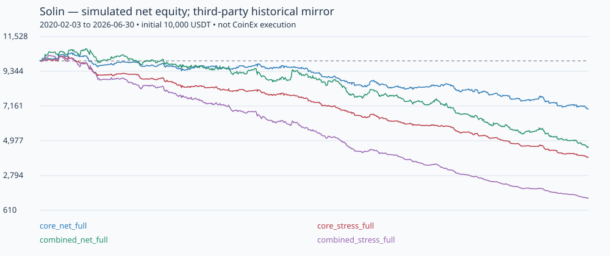

# نتیجهٔ اصلاحات امنیتی و بک‌تست Solin

**تاریخ:** ۲۰۲۶-۰۹-۲۰

**دامنه:** نسخهٔ همین مخزن و شاخهٔ `arena/01a0b9c0-solin`؛ پیشرفت‌های منتشرنشدهٔ Codespaces در این ارزیابی حضور ندارند.

## جمع‌بندی صریح

**این بار اصلاحات اجرایی اعمال شده‌اند، نه فقط گزارش ایراد.** امنیت دسترسی، نگهداری state و محاسبات Paper بهبود یافته و ۸۷ تست پذیرش رفتار صحیح را بررسی می‌کنند. بااین‌حال، **نتایج خالصِ استراتژی با قرارداد اجرای اصلاح‌شده و هزینه‌های انتخاب‌شده، مثبت نیستند. معاملهٔ واقعی همچنان در کد مسدود است.**

این نتایج «ارزیابی پژوهشی روی snapshot واسطِ تاریخی» هستند، نه تأیید عملکرد روی CoinEx. انتقال مستقیم اعداد به حساب واقعی یا نتیجه‌گیری دربارهٔ کد جدید Codespaces معتبر نیست.

## ۱. اصلاحات انجام‌شده و مرزهای آن‌ها

| موضوع | وضعیت فعلی |
|---|---|
| فعال‌شدن ناخواستهٔ Live | در `Settings`، `LiveBroker` و کلاینت HTTP مسدود شده است. فایل تأیید یا تعداد معامله آن را باز نمی‌کند. |
| کلیدها و محیط اجرا | کلاینت کلید نمی‌خواند/نمی‌پذیرد؛ دسترسی private و write پیش از شبکه رد می‌شود. `.env`، داده و cache از Git/build مستثنا هستند. |
| اسرار داخل image | `COPY . .` حذف و کپی انتخابی شده؛ متغیرهای Compose whitelist هستند؛ داشبورد کلید صرافی نمی‌گیرد. |
| وب | HTTP Basic با رمز تصادفی لازم، fail-closed بدون رمز، CSP، no-store، عدم استفاده از `innerHTML` و حذف scriptهای CDN. دسترسی عمومی نیازمند TLS است. |
| سطح دسترسی container | کاربر غیر-root، filesystem فقط‌خواندنی، حذف capability، محدودیت منابع، log rotation و volume فقط‌خواندنی داشبورد تنظیم شده‌اند. اجرای Docker محلی آزمایش نشده است. |
| پایداری Paper | SQLite با transaction و rollback journal، journal و checkpoint هماهنگ، کنترل revision، قفل تک‌نویسنده و بازیابی equity/position/indicator/pending signal. |
| حسابداری | PnL مقدارمحور برای Long/Short، کارمزد و slippage، funding در replay، ریسک تنظیم‌شده، سقف notional و عدم clipping زیان. |
| زمان و داده | فقط کندل بسته، رد NaN/OHLC نامعتبر/تکرار/gap، backfill همهٔ کندل‌ها، خروج زمانی مستقل از بافر و H4 کاملاً بستهٔ UTC. |
| منطق خروج | stop قبلی قبل از trailing جدید؛ تریلینگ از کندل بعد؛ برخورد مبهم به نفع stop فرض می‌شود، نه سود خوش‌بینانه. |
| Circuit Breaker | قفل ورود جدید بر مبنای equity روز UTC؛ هرگز مانع مدیریت/خروج پوزیشن موجود نمی‌شود. |
| داشبورد | درصدها و breaker از schema واحد؛ error یا بازار کهنه دیگر صرفاً به‌علت heartbeat تازه «سالم» نیست. خواندن محدود و فقط‌خواندنی است. |

**حل‌نشده برای Live:** reconciliation واقعی صرافی، ACK در برابر fill، partial fill، idempotency سفارش واقعی، حفاظت stop سمت صرافی، margin/liquidation و آزمایش حساب واقعی. این‌ها با یک ادعای «رفع کامل» پنهان نشده‌اند؛ به همین دلیل کل مسیر Live بسته مانده است. اصلاح فیلد `type=market` و `market_type` به‌تنهایی گواه درست‌بودن اجرای واقعی نیست.

اگر نسخهٔ قبلی پوزیشن واقعی دارد، قبل از مهاجرت باید مستقیماً در صرافی تعیین تکلیف شود. نسخهٔ جدید هیچ حساب واقعی را نمی‌خواند یا نمی‌بندد و state قدیمی را خودکار مهاجرت نمی‌دهد.

## ۲. شواهد امنیت و آزمون نرم‌افزار

- **۸۷ تست پذیرش: موفق.** این تست‌ها رفتار مطلوب را assert می‌کنند، نه وجود نقص را مثل ابزار تشخیصی نسخهٔ قبلی.
- پوشش مهم: منع همهٔ عملیات خصوصی، تنظیم ریسک، Long/Short، هزینه و funding، gap، ترتیب stop/trailing، زمان نگهداری پس از ۱۰۰۰ کندل و restart، rollback، تک‌نویسنده، عدم پیشروی checkpoint در شکست، auth، دادهٔ کهنه، و اجرای کامل دو polling شبیه‌سازی‌شده با restart.
- آزمون restart/prefix نشان می‌دهد برای ورودی یکسان، اندیکاتورها و سیگنال‌های پردازش ترتیبی/بازیابی‌شده برابرند؛ موتور به کندل آینده دسترسی ندارد.
- نصب دقیق `requirements-dev.txt` با `--require-hashes` موفق بود؛ `pip check`، `ruff check` و `ruff format --check` نیز موفق بودند.
- `pip-audit --strict`: **22 وابستگی runtime و 52 وابستگی مجموعهٔ توسعه، صفر آسیب‌پذیری شناخته‌شدهٔ گزارش‌شده** در زمان اسکن. این دو شمارش مجموعه‌های هم‌پوشان‌اند، نه جمع دو مجموعهٔ مستقل.
- [خروجی اسکن وابستگی](dependency-audit-2026-09-20.json) ثبت شده است. این اسکن جای ممیزی کامل برنامه، OS/container، بررسی تاریخچهٔ secret یا penetration test را نمی‌گیرد.
- یک هشدار deprecation مربوط به سازگاری TestClient/Starlette وجود دارد؛ خطای تست نیست.
- حالت journal عمداً `DELETE` است: در آزمون mount شبیه‌سازی‌شدهٔ فقط‌خواندنی، WAL پس از خروج نویسنده به ساخت فایل جانبی نیاز داشت. نسخهٔ اصلاح‌شده بعد از خروج بات نیز بدون نوشتن به volume خوانده می‌شود.
- اجرای محلی روی Python ۳.۱۱.۲ انجام شد. workflow برای Python ۳.۱۱ و ۳.۱۲ و build/smoke test Docker اضافه شده؛ در محیط محلی Docker موجود نبود. صرف وجود workflow، ادعای موفقیت اجراهای CI نیست.
- هیچ سفارش واقعی، ورود به حساب یا آزمایش با کلید واقعی انجام نشده است.

## ۳. منبع داده و میزان اعتماد

اتصال مستقیم TLS به CoinEx و آرشیو اصلی Binance از محیط این بررسی برقرار نشد. اعتبارسنجی TLS خاموش نشد. دو **data blob عمومی با نسخهٔ ثابت** از GitHub دریافت شدند؛ فقط CSV خوانده شد و هیچ کد مخزن ثالث اجرا نشد.

### snapshot منتسب به Binance USD-M BTCUSDT

- ناشر: `SpaciousAbhi/binance-futures-backtest-research`.
- [فایل در commit ثابت](https://github.com/SpaciousAbhi/binance-futures-backtest-research/blob/4388b2cc2b7b5ca7d9cb81a29b39a14ca940b4a1/data/processed/BTCUSDT_1h_processed.csv).
- **۵۶٬۹۵۳ کندل ساعتی**، از ۲۰۲۰-۰۱-۰۱ تا کندل ۲۰۲۶-۰۷-۰۱ ساعت ۰۰ UTC؛ همراه ستون taker buy و نرخ funding.
- در ارزیابی اصلی، انتهای بازه **۲۰۲۶-۰۷-۰۱ انحصاری** است؛ کندل روز اول ژوئیه وارد امتیازدهی نشده است.
- ۸۰۰ کندل نخست صرف warmup می‌شوند؛ بازهٔ امتیازدهی اصلی از **۲۰۲۰-۰۲-۰۳ ساعت ۰۸ UTC تا پایان ۲۰۲۶-۰۶-۳۰**، شامل ۵۶٬۱۵۲ ساعت است.
- funding در فایل ناشر روی کندل‌ها forward/as-of join شده بود. **۷٬۱۲۰ تسویهٔ یکتا** استخراج شد تا نرخ یک تسویه در هر ساعت دوباره کسر نشود؛ فاصله‌ها دقیقاً ۸ ساعت بودند.
- زمان‌هایی با چند میلی‌ثانیه اختلاف به bucket ساعتی تسویه منتقل شدند. نرخ در notional قیمت Open ضرب می‌شود؛ این تقریبِ funding است، نه بازسازی Mark Price صرافی.

### snapshot منتسب به Bybit BTCUSDT perpetual

- ناشر: `mestoness/btc-eth-candles-history`.
- [فایل در commit ثابت](https://github.com/mestoness/btc-eth-candles-history/blob/df3095a22122bb52eef77673fce5879d80193cd2/BTCUSDT_60.csv).
- **۴۹٬۹۵۷ کندل ساعتی** از ۲۰۲۰-۰۳-۲۵ تا ۲۰۲۵-۱۲-۰۵؛ بدون taker و funding تاریخی.
- برای مقایسهٔ این منبع، Whale خاموش و پایان ارزیابی ۲۰۲۵-۱۲-۰۱ انحصاری انتخاب شد. funding فقط به‌شکل هزینهٔ فرضی نامطلوب ۱ یا ۲ bps هر ۸ ساعت مدل شد؛ درآمد احتمالی funding منظور نشده است.

هر دو مجموعه از نظر timestamp/UTC، پیوستگی ساعتی، عدم تکرار، بسته‌بودن کندل، مقادیر متناهی، حدود OHLC و حجم بررسی شدند. حجم صفر در آن‌ها نبود. در ۴۹٬۹۵۷ ساعت مشترک، میانهٔ اختلاف قدرمطلق قیمت Close حدود ۰.۰۱۵۹٪ و صدک ۹۹ حدود ۰.۱۳۷۰٪ بود؛ این **بررسی سازگاری** است، نه اثبات اصالت.

**محدودیت اساسی:** hash و commit فقط تضمین می‌کنند همان snapshot دوباره خوانده می‌شود؛ اصالت ادعای ناشر دربارهٔ دادهٔ صرافی را ثابت نمی‌کنند. checksum آرشیو اصلی قابل تطبیق نبود. نتایج فعلاً پژوهشی‌اند؛ برای اعتبارسنجی نهایی باید روی دادهٔ اصلیِ قابل‌ردیابی پروژه/Codespaces و در نهایت منبع مناسب CoinEx تکرار شوند. دادهٔ خام و ledgerهای حجیم در Git وارد نشده‌اند.

## ۴. فرضیات ازپیش‌مشخص‌شدهٔ اجرا

- سرمایهٔ آغاز هر آزمایش مستقل: ۱۰٬۰۰۰ USDT؛ ریسک هدف ۱٪، سقف notional برابر ۲ برابر سرمایه و یک پوزیشن هم‌زمان.
- حالت پایه: کارمزد فرضی هر سمت **۶ bps** و slippage نامطلوب هر fill **۲ bps**؛ این‌ها نرخ تأییدشدهٔ حساب کاربر نیستند.
- حالت فشار: کارمزد هر سمت **۱۰ bps**، slippage **۱۰ bps**، به‌علاوهٔ **۲ bps هزینهٔ نامطلوب هر ۸ ساعت** علاوه بر funding تاریخی در منبع Binance.
- سیگنال روی کندل بسته تولید و در Open کندل بعد اجرا می‌شود؛ در gap، قیمت Open و هزینه لحاظ می‌شود، نه stop قدیمیِ دست‌نیافتنی.
- در برخورد مبهم stop/target، stop مقدم است؛ trailing حاصل از High/Low همین کندل تنها در کندل بعد اعمال می‌شود.
- خروج زمانی بعد از ۱۰ کندل نگهداری، در Open بعدی است. پوزیشن باز انتهای آزمایش با هزینهٔ خروج بسته می‌شود.
- برای تعیین PnL از مقدار واقعی شبیه‌سازی‌شده و اختلاف fill استفاده می‌شود؛ هیچ سقف مصنوعی روی R/زیان نیست. همهٔ اجراها با جمع ledger و تغییر equity تطبیق داده شدند.
- تمام ۱۴ سناریو پیش از حلقهٔ اجرا در `scenario_plan.json` ثبت شدند. پارامترها برای پیدا کردن سود یا بهترکردن سال خاص جست‌وجو/بهینه‌سازی نشدند.

این اصلاحات، خصوصاً H4 بسته و ترتیب محافظه‌کارانهٔ trailing، قرارداد اجرا را نسبت به کد قدیمی تغییر می‌دهند. پس مقایسه با PF قدیمیِ فاقد runner، مقایسهٔ دو آزمایش یکسان نیست.

## ۵. نتایج اصلی با هزینه

**منبع: snapshot واسط Binance؛ بازده کل دوره، نه سالانه.** افت سرمایه بر اساس ارزش حساب در Close ساعتی است، نه بدترین افت داخل کندل.

| سناریو | معاملات بسته | بازده خالص کل | PF خالص | بیشترین افت Close-to-Close | سرمایهٔ نهایی USDT |
|---|---:|---:|---:|---:|---:|
| شکست فشرده، بدون Whale | 765 | -30.20٪ | 0.762 | -33.80٪ | 6,980.31 |
| شکست + Whale با ستون taker موجود در snapshot | 1,723 | -53.87٪ | 0.786 | -57.83٪ | 4,612.67 |
| بدون Whale، هزینهٔ سنگین‌تر | 761 | -60.56٪ | 0.474 | -61.91٪ | 3,944.02 |
| ترکیبی، هزینهٔ سنگین‌تر | 1,699 | -86.26٪ | 0.524 | -86.91٪ | 1,373.86 |

PF کمتر از ۱ یعنی مجموع سود معاملات برنده از مجموع قدرمطلق زیان معاملات بازنده کمتر بوده است. نرخ برد به‌تنهایی کافی نیست؛ مثلاً نسخهٔ بدون Whale در حالت پایه حدود ۵۴.۸٪ برد دارد ولی زیان‌ده است.



## ۶. بازه‌های زمانی جداگانه

هر سطر با سرمایهٔ اولیهٔ تازهٔ ۱۰٬۰۰۰ و همان پارامترها اجرا شده؛ تاریخچهٔ قبل از شروع فقط برای اندیکاتورهاست، نه سود و زیان سطر. هزینه‌های حالت پایه و funding تاریخی اعمال شده‌اند.

| بازه | بازده بدون Whale | PF بدون Whale | بازده ترکیبی | PF ترکیبی |
|---|---:|---:|---:|---:|
| 2024 | -7.03٪ | 0.713 | -17.89٪ | 0.667 |
| 2025 | -7.70٪ | 0.716 | -18.37٪ | 0.664 |
| نیمهٔ اول ۲۰۲۶ | -6.10٪ | 0.531 | -14.87٪ | 0.530 |

این بازه‌ها برای بررسی پایداری زمانی‌اند. چون استراتژی/پارامترهای اولیه ممکن است قبلاً با همین سال‌ها طراحی شده باشند، آن‌ها را **آزمون کور یا holdout دست‌نخوردهٔ تضمین‌شده** معرفی نمی‌کنیم.

## ۷. تشخیص اثر هزینه و منبع دوم

- بدون کارمزد، slippage و funding — **فقط سناریوی تشخیصی، غیرقابل‌معامله** — بازده کل نسخهٔ بدون Whale **+۶.۶۲٪** و نسخهٔ ترکیبی **+۱۶.۶۷٪** شد؛ PF هر دو حدود **۱.۰۴۶** است.
- با اعمال هزینه‌های تعریف‌شده هر دو زیان‌ده شدند. اختلاف دو اجرا را نباید دقیقاً «جمع کارمزدها» دانست؛ sizing، stop، تعداد معاملات و توقف روزانه هم با هزینه تغییر می‌کنند.
- روی snapshot واسط Bybit، نسخهٔ بدون Whale با هزینهٔ پایه و funding فرضی نامطلوب، **−۲۳.۷۲٪** بازده و **PF≈۰.۷۸۸** داشت؛ در فشار هزینه، **−۵۵.۲۲٪** و **PF≈۰.۴۶۹**.
- نتیجهٔ Bybit هم جهت ضعف عملکرد خالص است، ولی به علت تفاوت دوره، منبع و نبود funding واقعی، مقایسهٔ عددی آن با Binance کاملاً همسان نیست.

**نتیجهٔ پژوهشی:** در این قرارداد اجرای اصلاح‌شده، شواهد فعلی از مزیت خالص قابل اتکا پشتیبانی نمی‌کنند. افزودن Whale نیز در این داده/هزینه مشکل را حل نکرده است. فعال‌سازی Live یا بهینه‌سازی صرفاً برای سبزکردن همین بازه‌ها گام مناسبی نیست.

## ۸. آنچه هنوز نمی‌دانیم

1. آیا کد و دادهٔ اصلی Codespaces منطق، پارامتر یا مدل اجرای متفاوت و قابل اثباتی دارد؟
2. نتیجه روی دادهٔ اصلی صرافی با checksum مستقل و ورودی واقعی Order Flow چیست؟
3. ترتیب داخل کندل و کیفیت fill با دادهٔ دقیقه‌ای/ریزتر و هزینه‌های حساب هدف چه تغییری ایجاد می‌کند؟
4. اثر order book، latency، partial fill، price/quantity rules واقعی، margin و liquidation چقدر است؟ این‌ها مدل نشده‌اند.
5. نتیجهٔ یک آزمایش واقعاً prospective/کور پس از تثبیت فرضیات چه خواهد بود؟ نتایج تاریخی جای آن را نمی‌گیرند.

ضمن اینکه funding در polling عمومیِ Paper فعلاً در دسترس نیست و محاسبه نمی‌شود؛ داشبورد این محدودیت را نشان می‌دهد. شبیه‌سازی آنلاین فعلی جای ledger واقعی حساب futures نیست.

## ۹. بازتولید و خروجی‌ها

```bash
python3 -m venv .venv
.venv/bin/python -m pip install --require-hashes -r requirements-dev.txt
.venv/bin/python -m pytest -q
.venv/bin/python -m research.run_matrix
```

- ماتریس: `research/run_matrix.py`، ۱۴ سناریوی ثابت.
- کد اجرای مشترک: `engine/session.py` و `engine/broker.py`.
- نتایج و منبع هر سناریو: [backtests-2026-09-20.json](backtests-2026-09-20.json).
- در JSON، hash کد، lock وابستگی، CSV، funding، blob/commit منبع و پارامترها ثبت شده‌اند.
- ledger و equity هر اجرا: `artifacts/backtests-2026-09-20/<scenario>/`؛ فایل‌های حجیم عمداً خارج از Git هستند و با همین فرمان بازتولید می‌شوند.
- برای دادهٔ Codespaces، فرمت CSV و فرمان تک‌آزمایش در [README](../../README.md) مستند است؛ هیچ secret یا کلید حسابی لازم نیست.

**گام بعدی پیشنهادی:** تطبیق با نسخهٔ جدید Codespaces و بازتولید پژوهش اصلی روی دادهٔ اصیل؛ سپس بررسی علت ضعف مزیت پس از هزینه. زیرساخت امن‌تر و خروجی قابل حسابرسی آماده‌تر شده است، اما نتیجهٔ معاملاتی فعلی هنوز مجوز استفادهٔ واقعی نمی‌دهد.
